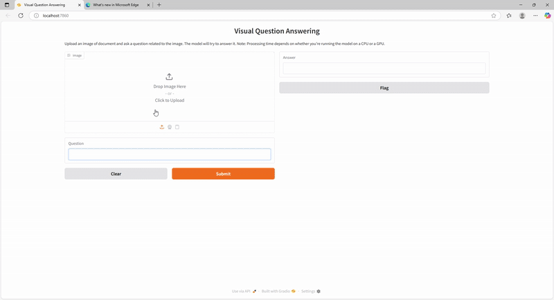

# DIVE-Doc: Downscaling foundational Image Visual Encoder into hierarchical architecture for DocVQA 
<div align="center">Official implementation of DIVE-Doc | Paper | Poster | Slide </div>

## Description

**DIVE-Doc** is an end-to-end trade-off between LVLMs and lightweight architectures in the context of DocVQA. It is built by distilling the SigLIP-400m visual encoder of PaliGEMMA into a small hierarchical Swin transformer, while reusing the original GEMMA decoder. This allowed us to keep competitive performance with the teacher while reducing the visual encoder's parameters to one-fifth.

## Demo & Trained Models



You can use the model on a gradio web-interface by running:
```bash
python app.py
```
The trained models presented in the paper can be download on hugging face.

| Model                    | VE Latency (ms)| ANLS Score ↑ | Download |
|--------------------------|--------------|----------------|-----|
| **DIVE-Doc (FRD)**       | 446     | **82.67**  |   [🤗 Hugging Face](https://huggingface.co)  |
| **DIVE-Doc (ARD/HRes)**  | 520     | 82.63        |  [🤗 Hugging Face](https://huggingface.co)   |
| **DIVE-Doc (ARD/LRes)**  | **270**    | 79.26       |   [🤗 Hugging Face](https://huggingface.co)  |


## Installation

To set up the development environment, follow these steps:

1.  **Clone the repository:**
    ```bash
    git clone [https://github.com/JayRay5/DIVE-Doc](https://github.com/JayRay5/DIVE-Doc)
    cd DIVE-Doc
    ```
2.  **Create a conda environment (recommended):**
    ```bash
    conda create -n dive-doc python=3.9
    conda activate dive-doc
    ```
3.  **Install dependencies:**
    ```bash
    pip install -r requirements.txt
    ```
    
## Repository Structure
```bash
DIVE-Doc
├── data
|   ├── dla
|   |    └── utils.py
|   |
|   ├── doc-cls
|   |
│   └── docvqa
|       ├── build_image_dataset.py #generate images from the docvqa dataset without duplicated samples for the distillation stage.
│       ├── build_image_embeddings.py #generate embeddings of the teacher paligemma for the distillation stage.
│       └── utils.py             
|
|
├── experiments #contains saved models and results of the experiments.
|            .
|            .
|
├── models 
│   ├── config_divedoc.py #contains config classes for huggingface docvqa models.
|   ├── dla_config.py #contains config classes for huggingface dla models.
|   ├── dla_model.py #contains huggingface dla models.
│   ├── lightning_modules.py #contains lightning torch classes for the distillation stage.
│   ├── model.py #contains huggingface docvqa models.
|   └── visual_encoders.py #contains torch visual encoder models.
│   
│     
└── training
|   ├── dla # contains script for training and evaluation of models.
|   |    ├── config.py #use to set the VE architecture of the student & hyperparameters for the distillation stage.
|   |    ├── test.py #Generate segmentation performance on the test set for the chosen model.
|   |    ├── train.py #Training pipeline for a DIVE-Doc model trained until finetuning_stage2 or for Donut & PaliGEMMA VE.
|   |    └── utils.py 
|   |
|   ├── doc-cls
|   |
|   └── docvqa # contains script for training and evaluation of models.
|        ├── config.py #use to set the VE architecture of the student & hyperparameters for the distillation stage.
|        ├── distillation_stage1.py #pipeline training for the distillation stage.
|        ├── evaluation.py #generate answer for the DocVQA test set.
|        └── finetuning_stage2.py #pipeline training for the end-to-end finetuning stage.
|        
|
├── app.py #pipeline to use the model in inference with a web gradio interface.
└── token.json #add inside a HuggingFace token to be able to access to the teacher model from HuggingFace.
```
## Training & Evaluation

### DocVQA
1. **Dataset**
```bash
cd dataset/docvqa
python build_image_dataset.py #generate image png without duplicated samples
python build_image_embeddings.py #generate Paligemma image embeddings 
```
2. **Distillation stage** <br>
You can set the student configuration you want or a new one in
```bash
./trainning/docvqa/config.py
```
Then, start the distillation script: 
```bash
cd training/docvqa
python distillation_stage1.py #the script will create a new folder in ./experiments, which will contain the weights of this training stage
```
3. **Finetuning stage**
Once you have a distilled model, you can finetune with QLORA using the following script:
```bash
python finetuning_stage2.py #You have to put the path of the folder created by the distillation pipeline in this script
```
4. **Evaluation** <br>
You can evaluate the distillation stage model or the final model with the following script by inserting the model path in the experiment folder.
```bash
python evaluation.py
```
This script will generate a results.json file containing the predicted answers for the test set, which will be saved in the corresponding model folder in ./experiment. <br>
To assess the performance, please upload the mentioned file on the [Robust Reading Competition website](https://rrc.cvc.uab.es/?ch=17&com=evaluation&task=1).
### Document Classification

### Document Layout Analysis 

## Citation

If you find DIVE-Doc useful for your research, please consider citing our paper:

```bibtex
@inproceedings{your_paper_id,
  author = {Anonymous ICCV Submission}, % Replace with actual authors after blind review
  title = {DIVE-Doc: Downscaling foundational Image Visual Encoder into hierarchical architecture for DocVQA},
  booktitle = {Proceedings of the ICCV Workshop on Vision and Document Intelligence}, % Update with actual workshop name if different
  year = {2025} % Update with actual publication year
}
